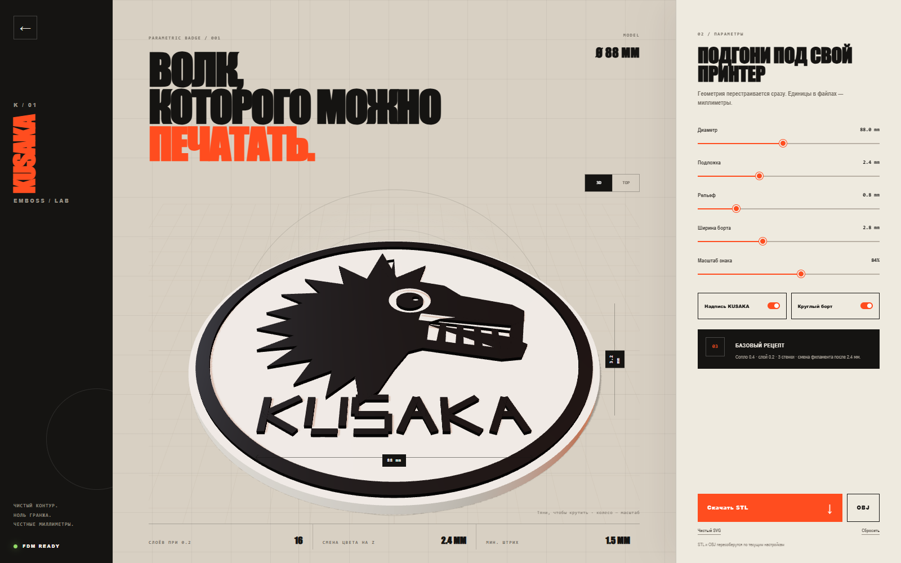

# KUSAKA Raster Emboss Lab



Браузерный конструктор печатного 3D-рельефа из чёрно-белых изображений.
Загружаешь PNG, JPG или WebP, настраиваешь Levels и геометрию, смотришь
результат в Three.js и скачиваешь готовый 3MF, STL или OBJ.

Вся обработка пользовательских файлов выполняется локально в браузере. Сервер
не получает и не хранит загруженные картинки.

## Что умеет

- живое 3D-превью с вращением и видом сверху;
- Black point, White point, Gamma, Threshold, мягкость края и Blur;
- светлое или тёмное изображение в роли рельефа;
- диаметр, толщина основы, высота рельефа, размер и положение картинки;
- опциональный круглый борт;
- замкнутая печатная геометрия без z-fighting;
- heightfield `384 × 384` с интерполированным субпиксельным контуром;
- двухматериальный 3MF для Bambu Studio: основа → филамент 1,
  рельеф → филамент 2;
- экспорт текущей настройки в 3MF, бинарный STL и текстовый OBJ;
- статическая production-сборка без базы данных и серверного API.

## Быстрый запуск

Понадобится Node.js 22 или новее.

```bash
git clone https://github.com/tensorsdynamics/kusaka-emboss-lab.git
cd kusaka-emboss-lab
npm ci
npm run dev
```

Открой `http://localhost:5173`.

## Production-сборка

```bash
npm run build
npm run preview
```

Готовый статический сайт появится в `dist/`. Эту папку можно разместить на
любом статическом хостинге.

## Запуск через Docker

```bash
docker compose up --build -d
```

После сборки приложение будет доступно на `http://localhost:8080`.

Остановить контейнер:

```bash
docker compose down
```

## Как пользоваться

1. Открой вкладку **Картинка**.
2. Загрузи контрастную PNG, JPG или WebP.
3. Настрой Levels, Threshold и мягкость края.
4. Во вкладке **Геометрия** задай диаметр, толщину основы и высоту рельефа.
5. Проверь модель в ракурсах **3D** и **TOP**.
6. Для Bambu Studio и AMS скачай **3MF · AMS**. Для универсального
   одноцветного экспорта используй STL или OBJ.

Базовый рецепт для FDM: сопло 0,4 мм, слой 0,2 мм, три стенки. Для
двухцветной печати меняй филамент после высоты основы, указанной в интерфейсе.

## Bambu Studio и AMS

Экспорт **3MF · AMS** создаёт один собранный объект из двух замкнутых частей:

- `Base / Filament 1` — круглая основа;
- `Relief / Filament 2` — картинка и круглый борт.

Внутри 3MF записаны два логических филамента, цвета превью и назначения частей
`extruder 1/2`. Части соприкасаются на плоскости верха основы, но не
перекрываются объёмами. Файл не привязан к конкретному принтеру, соплу или
температуре.

1. Открой скачанный `.3mf` в Bambu Studio.
2. Если Studio спросит режим импорта, открой файл как проект.
3. В дереве объекта проверь назначения F1 и F2.
4. Перед отправкой сопоставь F1/F2 с реальными катушками AMS.
5. После нарезки проверь Preview: основа и рельеф должны иметь разные цвета.

Без AMS можно скачать STL и поставить ручную смену филамента после высоты
основы, показанной в интерфейсе.

## Команды

| Команда | Что делает |
| --- | --- |
| `npm run dev` | Запускает режим разработки |
| `npm run models` | Перегенерирует эталонные 3MF, STL и OBJ |
| `npm run typecheck` | Проверяет TypeScript |
| `npm run build` | Собирает production-версию в `dist/` |
| `npm run preview` | Локально показывает production-сборку |
| `npm test` | Перегенерирует модели, собирает проект и запускает тесты |

## Развёртывание

Подробные инструкции находятся в [руководстве по развёртыванию](docs/DEPLOY.md):

- GitHub Pages;
- Cloudflare Pages;
- Netlify;
- Vercel;
- Docker и nginx;
- любой обычный статический сервер.

## Документация

- [Развёртывание](docs/DEPLOY.md)
- [Печать и подготовка изображения](docs/PRINTING.md)
- [Разработка и архитектура](docs/DEVELOPMENT.md)
- [Как внести вклад](CONTRIBUTING.md)
- [Политика безопасности](SECURITY.md)

## Лицензия

Программный код — MIT. У демонстрационной графики KUSAKA отдельный статус:
подробности в [ASSET_LICENSES.md](ASSET_LICENSES.md).
